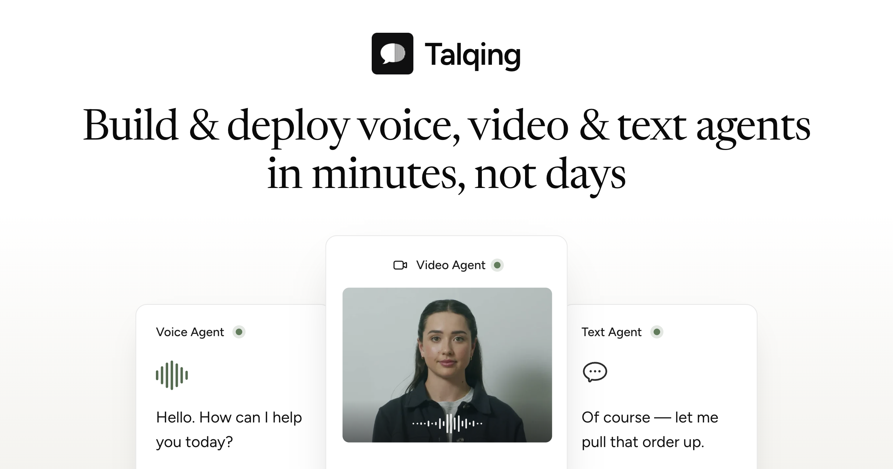
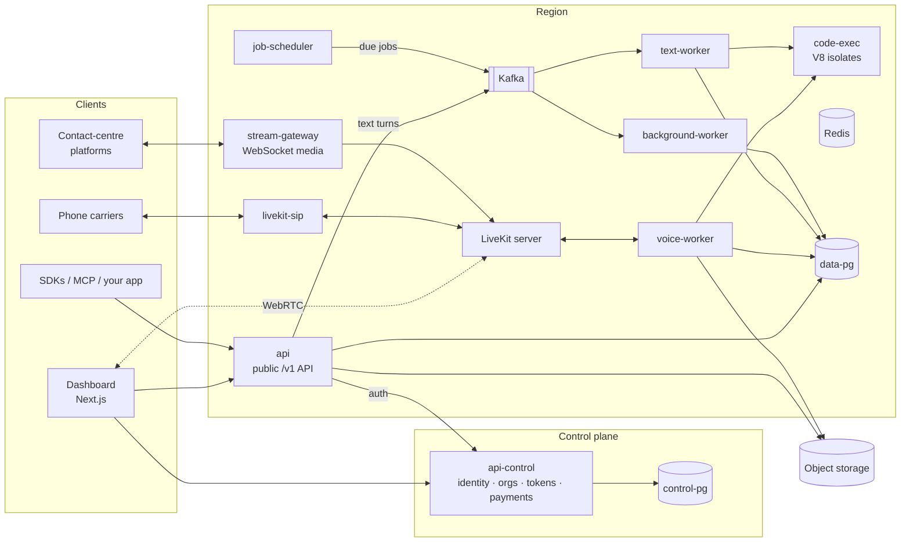

<div align="center">

<a href="https://talqing.com"></a>

# Talqing

**Build, publish and operate AI voice, video and text agents, without writing agent code.**

Built on [LiveKit Agents](https://github.com/livekit/agents). Bring your own model keys. Self-host the whole stack.

[Website](https://talqing.com) · [Documentation](https://docs.talqing.com) · [Hosted dashboard](https://app.talqing.com) · [API reference](https://docs.talqing.com/api-reference/introduction) · [MCP server](mcp/README.md) · [Book a demo](https://calendly.com/hello-talqing-tcsb/30min) · [hello@talqing.com](mailto:hello@talqing.com)

[](https://github.com/talqing/talqing/stargazers)
[](https://www.npmjs.com/package/@talqing/sdk)
[](https://www.npmjs.com/package/@talqing/mcp)
[](https://pypi.org/project/talqing/)
[](LICENSE.md)

</div>

---

## What is Talqing?

Talqing is a no-code builder for AI agents that talk to people: over the phone, in the browser, over video, and in chat. An agent is a system prompt, a model stack and the tools it can call. Anything you could write by hand as a LiveKit agent, you can build here, then put it on a phone number and read back every conversation it had.

You can build the same agent four ways, all backed by one API:

- **The dashboard.** Editors for agents, tools and tasks, plus telephony, conversations and observability.
- **The CoPilots.** A build assistant inside the agent, tool and task editors. It calls the same API you would, as you, with your role.
- **Your coding agent.** Point Claude Code, Codex or any MCP client at the [Talqing MCP server](mcp/README.md). It gets one tool per API endpoint.
- **The API and SDKs.** `/v1` over HTTPS, with generated [TypeScript](clients/typescript) and [Python](clients/python) clients.

If Talqing is useful to you, a star helps other people find it.

## Get started

**On Talqing Cloud (fastest).** Sign in at [app.talqing.com](https://app.talqing.com) with Google. Your first workspace gets $10 of credit in each region, India and the US. Add your provider keys under **Build → BYOK**, publish an agent and place a test call. The [voice agent quickstart](https://docs.talqing.com/get-started/quickstart-voice-agent) walks through it.

**On your own machine.** Follow the [self-hosting quickstart](#quickstart-self-hosting) below.

## Why Talqing

- **Your keys, your rates.** Models, speech, avatars and carriers bill your own accounts directly. On Talqing Cloud the only charge is a flat platform fee: $0.0035 per voice minute, $0.01 per video minute and $0.0001 per answered text message. See [pricing](https://docs.talqing.com/get-started/pricing-and-credits).
- **No ceiling below LiveKit.** Every agent compiles to a real LiveKit `AgentSession`, with each model a plugin instance pointed straight at the provider.
- **Source-available.** Read the code, run the whole stack yourself and modify it for your own business. See [License](#license).
- **Built to be driven by a coding agent.** Every dashboard action is an API operation, and the same set is exposed over MCP.

## Features

**Agents**
- Three channels: `voice` (phone and browser calls), `video` (a voice agent with an [Anam](https://anam.ai) avatar) and `text` (chat over the API, Telegram or WhatsApp).
- A speech-to-text → LLM → text-to-speech pipeline, or one realtime speech-to-speech model. Per-service fallbacks, turn detection, interruptions, voicemail detection, DTMF, background audio and image input.
- Drafts, published versions, history and rollback. Variables, per-call overrides and lifecycle hooks.
- Multi-agent teams with handoffs and context policies.
- **FAQs**: questions and the answers you want given, which the agent looks up mid-conversation.
- **Agent tasks**: an agent nobody talks to. It takes named inputs and returns a typed result, which suits research, classification and drafting.

**Tools and integrations**
- Tools are an ordered tree of operations: HTTP calls, sandboxed TypeScript, conditionals, variables, speech, handoffs, transfers to a human, keypad presses, ending the call, and RPC into your frontend.
- Integrations: any remote MCP server, native Google Calendar tools, Cal.com, Calendly, HubSpot, Asana, Jira, RocketReach, Exa and Tavily.

**Channels**
- Phone numbers from your own carrier account (Plivo, Twilio, Vobiz, Exotel), inbound and outbound, with transfers and call recording.
- Batch outbound calling with scheduling windows, retries, pause and resume.
- **Media streams**: a contact-centre platform keeps its numbers and streams call audio to your agent over a WebSocket.
- Web calls and chat embedded in your app via [`@talqing/react`](clients/typescript/packages/react).
- Telegram bots, WhatsApp (Twilio or Gupshup) for messages, template batches and voice calls, and email batches drafted by an agent task and sent through Resend.

**Operations**
- Every transcript, tool call, per-stage latency and cost line, plus recordings and post-call analysis (summary, outcome and extracted fields).
- HMAC-signed webhooks for session, agent, tool, recording and batch events.
- Workspaces with roles, personal access tokens, encrypted secrets, and multiple regions.

**Models.** Strict bring-your-own-key: OpenAI, Gemini, xAI, Deepgram, ElevenLabs, Sarvam, Soniox, Raya, OpenRouter, Anam and ai-coustics. Every model compiles to a real LiveKit plugin instance pointed straight at the provider. Providers and models are configured in [`backend/catalog.yaml`](backend/catalog.yaml).

## Quickstart (self-hosting)

The local stack runs as one `docker compose` project, and the dashboard runs on your host with `npm run dev`.

### Prerequisites

- Docker with Compose v2
- Node.js 20+
- A **Google OAuth client** (Web application). Sign-in is Google-only. Add `http://localhost:8001/v1/auth/google/callback` as an authorized redirect URI.
- An **S3-compatible bucket pair** for call recordings and chat attachments. The template is set up for DigitalOcean Spaces. Give the recordings bucket a CORS rule that allows `GET` and `HEAD` with the `Range` header from the dashboard's origin (`http://localhost:3000` locally); without it recordings play but the caller/agent channel switch is silent.
- An **[Exa](https://exa.ai) API key**, which the CoPilots use for web search. A region refuses to boot without one.
- An **OpenAI API key** for the CoPilots. They run on the platform's key, set by `copilot:` in `backend/catalog.yaml`. Agents always use the workspace's own keys.

### 1. Configure

```bash
git clone https://github.com/talqing/talqing.git && cd talqing

cp backend/.env.example backend/.env
cp backend/configs/example.region.config.yaml  backend/configs/local.in.config.yaml
cp backend/configs/example.control.config.yaml backend/configs/local.control.config.yaml
```

`backend/.env` only selects which config file a process loads. Everything else lives in the two YAML files. Both templates explain every key inline. Replace each `{{TOKEN}}` with a real value:

| Placeholder | Value |
| --- | --- |
| `PG_PASSWORD` | The `POSTGRES_PASSWORD` in `docker-compose.yml` (local only) |
| `LIVEKIT_API_KEY` / `LIVEKIT_API_SECRET` | The key pair in `backend/livekit.yaml` |
| `SESSION_SIGNING_KEY_PEM` / `SESSION_VERIFY_KEY_PEM` | An Ed25519 pair. Use the one-liner in the control template's header. The public half goes in both files. |
| `SECRETS_FERNET_KEY`, `OAUTH_STATE_KEY`, `CHAT_TOKEN_SECRET`, `WHATSAPP_SIP_PASSWORD` | Generate them with the commands in the region template's header |
| `IN_INTERNAL_TOKEN` | `openssl rand -hex 32`. Use the **same** value in both files. |
| `SPACES_*` | Your bucket credentials. Also set `storage.endpoint_url`, `storage.region` and both bucket names. |
| `EXA_API_KEY` | Your Exa key |

Then make four edits. The templates describe the hosted multi-region deployment, so a single-region local stack needs them:

1. **Control: `regions`.** Delete the `us` entry, including `US_INTERNAL_TOKEN`, and add `default: true` to the `in` entry.
2. **Control: `oauth.google`.** Set `client_id` and `client_secret`.
3. **Control: `billing.signup_grant_usd`.** Set it above `"0"`, for example `"10"`. Calls and chats need a positive credit balance to start, and this is how a new workspace gets one without payments configured.
4. **Region: `providers.openai.api_key`.** Set it so the CoPilots work.

### 2. Start the backend

```bash
docker compose up --build
```

Database migrations run on boot. When the stack settles, the control API is on `:8001` and the regional API is on `:8000`.

### 3. Start the dashboard

The dashboard depends on the local TypeScript packages, so build them once first:

```bash
npm --prefix clients/typescript ci && npm --prefix clients/typescript run build

cd frontend
npm install
npm run dev        # http://localhost:3000
```

`frontend/.env.development` already points the dashboard at the local control plane and the `in` region.

### 4. Build your first agent

1. Open http://localhost:3000 and sign in with Google. Your first sign-in creates a workspace.
2. Go to **Build → BYOK** and add keys for the providers your agent will use. OpenAI plus Deepgram covers LLM, STT and TTS.
3. Go to **Build → Agents → New agent**, write a prompt, pick models, then **Publish**.
4. Start a **test call**, allow the microphone and talk. When you hang up, the call shows its transcript, latency breakdown and cost.

The [voice agent quickstart](https://docs.talqing.com/get-started/quickstart-voice-agent) walks through this in detail.

> [!NOTE]
> The local stack handles browser calls, text agents and SIP trunk configuration. Real PSTN calls need `livekit-sip` (port 5060 plus its RTP range) reachable from your carrier.

## Architecture

Talqing is a UI and API layer over the LiveKit Agents framework, plus the plumbing a production agent needs: versioning, telephony, billing, observability and multi-tenancy.



| Service | Role | Local port |
| --- | --- | --- |
| `api-control` | Control plane: Google sign-in, organizations, members, tokens, payments, the region list. One per deployment. | 8001 |
| `api` | A region's public `/v1` API. Everything a workspace is made of. | 8000 |
| `voice-worker` | LiveKit agent worker for voice and video: web rooms, SIP calls, media streams | 9091 (metrics) |
| `text-worker` | Text agents and the CoPilots, consuming turns from Kafka | — |
| `background-worker` | Call, email and WhatsApp batches, retention purges | — |
| `job-scheduler` | Publishes due `scheduled_jobs` to Kafka. It never runs them. | — |
| `stream-gateway` | WebSocket media streams from contact-centre platforms | 8090 |
| `code-exec` | Runs tool TypeScript in a fresh V8 isolate per request, with no platform credentials | — |
| `livekit`, `livekit-sip` | Self-hosted LiveKit server and SIP bridge | 7880–7881, 5060 |
| `control-pg`, `data-pg`, `pgbouncer` | Postgres for each plane, behind one transaction-pooling proxy | 5433, 5434 |
| `redis`, `kafka` | LiveKit state and live event fan-out; text turns and job delivery | 6379, 29092 |

The control plane holds identities and money. Each region holds tenant data and runs tenant code, and reaches control over HTTP with no database connection into it. [`backend/README.md`](backend/README.md) maps the code, and [`backend/workers/README.md`](backend/workers/README.md) covers the runtime processes.

## Repository layout

| Path | What's there |
| --- | --- |
| [`backend/`](backend) | Python 3.12. FastAPI apps (`api/`), domain services (`services/`), the agent compiler (definition → LiveKit `AgentSession`, in `compiler/`), workers, migrations, and the provider/model catalog |
| [`frontend/`](frontend) | Next.js dashboard, deployed as a static export |
| [`clients/typescript/`](clients/typescript) | `@talqing/sdk` (generated API client), `@talqing/client` (browser calls and chats) and `@talqing/react` |
| [`clients/python/`](clients/python) | `talqing`, the generated Python SDK |
| [`mcp/`](mcp) | `@talqing/mcp`, the MCP server for Claude Code, Codex and other MCP clients |
| [`openapi/`](openapi) | The exported OpenAPI document that every client is generated from |
| [`code-exec/`](code-exec) | The Node sandbox service for tool code |
| [`documentation/`](documentation) | The docs site behind [docs.talqing.com](https://docs.talqing.com) (Mintlify) |
| [`examples/`](examples) | A media-stream emulator and a sample frontend for avatar agents with frontend actions |

## Client packages

| Package | Install | Use it to |
| --- | --- | --- |
| `@talqing/sdk` | `npm i @talqing/sdk` | Call the `/v1` API from TypeScript |
| `@talqing/client` | `npm i @talqing/client` | Join voice, video and chat sessions from a browser |
| `@talqing/react` | `npm i @talqing/react` | Use React hooks and components on top of `@talqing/client` |
| `talqing` | `pip install talqing` | Call the `/v1` API from Python |
| `@talqing/mcp` | `npx -y @talqing/mcp` | Build agents from Claude Code, Codex or any MCP client |

Connect Claude Code to a region of Talqing Cloud, or to a self-hosted stack by setting `TALQING_BASE_URL` to `http://localhost:8000`:

```bash
claude mcp add talqing \
  -e TALQING_BASE_URL=https://api.in.talqing.com \
  -e TALQING_API_KEY=tq_your_token \
  -- npx -y @talqing/mcp
```

[`mcp/README.md`](mcp/README.md) has the same setup for Codex and other MCP clients.

## Documentation

- [Introduction](https://docs.talqing.com/get-started/introduction) and [core concepts](https://docs.talqing.com/get-started/core-concepts)
- Quickstarts: [voice agent](https://docs.talqing.com/get-started/quickstart-voice-agent), [phone number](https://docs.talqing.com/get-started/quickstart-phone-number), [text agent in code](https://docs.talqing.com/get-started/quickstart-text-agent), [coding agent via MCP](https://docs.talqing.com/get-started/quickstart-coding-agent)
- Guides: [inbound support line](https://docs.talqing.com/guides/inbound-support-line), [outbound lead qualification](https://docs.talqing.com/guides/outbound-lead-qualification), [appointment booking](https://docs.talqing.com/guides/appointment-booking), [migrating from Vapi](https://docs.talqing.com/guides/migrating-from-vapi)
- [API reference](https://docs.talqing.com/api-reference/introduction) · [SDKs](https://docs.talqing.com/sdks/overview) · [MCP](https://docs.talqing.com/mcp/overview)

To preview the docs locally, see [`documentation/README.md`](documentation/README.md).

## Development

```bash
# Backend: lint and format (uv, from backend/)
cd backend && uv sync --all-groups && uv run ruff check . && uv run ruff format .

# Dashboard: type check (keep `npm run dev` running; don't run `npm run build` alongside it)
cd frontend && npx tsc --noEmit
```

Backend code is mounted into the containers, so after editing it run `docker compose restart <service>`. Pre-commit hooks are defined in [`.pre-commit-config.yaml`](.pre-commit-config.yaml).

## Contributing

Issues and pull requests are welcome. [`CONTRIBUTING.md`](CONTRIBUTING.md) covers setup, the checks a change has to pass and how the SDKs are regenerated. For anything larger than a small fix, open an issue first so we can agree on the design.

Please report security vulnerabilities privately, not in a public issue. [`SECURITY.md`](SECURITY.md) says how.

## License

Talqing is source-available under the [Sustainable Use License](LICENSE.md). You can self-host and modify it for free for your own business or for personal use. You cannot sell it, host it for others, or resell agents built on a self-hosted copy; for that, use [Talqing Cloud](https://app.talqing.com) or write to [hello@talqing.com](mailto:hello@talqing.com) for a commercial license.

The client SDKs ([`clients/typescript`](clients/typescript), [`clients/python`](clients/python)) and the MCP server ([`mcp`](mcp)) are MIT-licensed, so you can use them in any application; see the `LICENSE` file in each package.

"Talqing" and the Talqing logo are trademarks of Oggnai Technologies Private Limited and are not covered by either license. Third-party names and logos in this repository belong to their owners.
